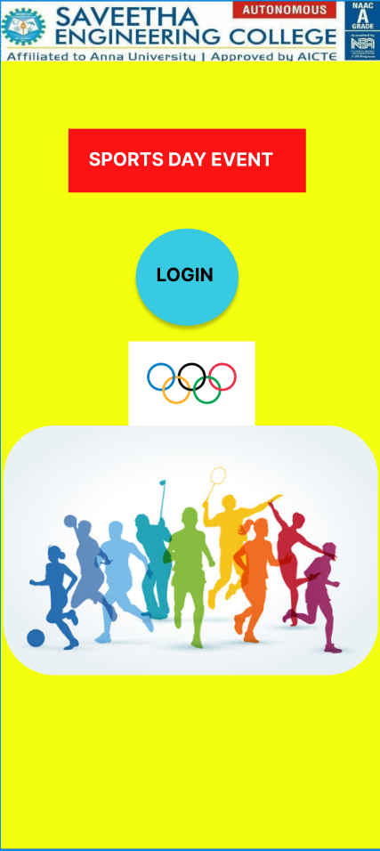
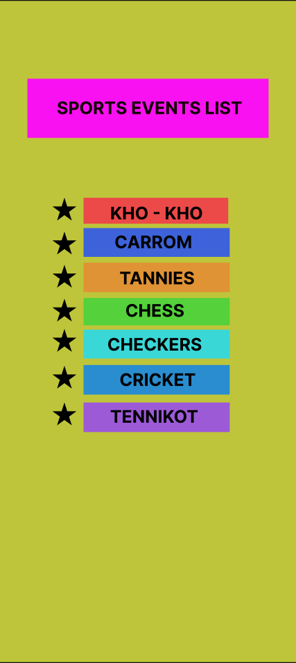
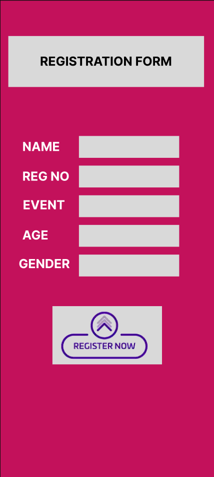

# Ex09 Event Registration Web Application
## Date:15/11/2025

## AIM:
To design, develop and deploy a web application for event registration.

## DESIGN STEPS:

### Step 1:
Create a new frame.

### Step 2:
Select any one preset size of your choice.

### Step 3:
Select the shapes you need.

### Step 4:
Import images as needed.

### Step 5:
Create pages based on your need and link them.

### Step 6:

Validate the HTML and CSS code.

### Step 6:

Publish the website in the given URL.

## DESIGN TOOL:
Figma

## CODE:
# page1:
~~~html
<!DOCTYPE html>
<html>
<head>
  <meta charset="utf-8" />
	<meta name="viewport" content="width=device-width, initial-scale=1, shrink-to-fit=no">
	<link href="https://fonts.googleapis.com/css2?family=Inter:ital,wght@0,100;0,300;0,400;0,500;0,700;0,900;1,100;1,300;1,400;1,500;1,700;1,900&display=swap" rel="stylesheet">
	<link rel="stylesheet" href="css/reset.css" />
	<link rel="stylesheet" href="css/global.css" />
	<link rel="stylesheet" href="css/android-compact.css" />

</head>

<body>
	
SPORTS DAY EVENT

	<button class="btn-login hover-bright">LOGIN</button>
	
</body>

</html>
~~~
~~~css
body {
	min-height: 100%;
	display: flex;
	flex-direction: column;
	align-items: center;
	gap: 17px;
	font-size: 20px;
	font-family: 'Inter';
	font-weight: 700;
	line-height: normal;
	letter-spacing: 0px;
	background-color: #f3ff0d;
	padding: 138px 12px 458px 12px;
	overflow: auto;
}

.sports-day-event {
	margin-left: -9px;
	width: 257px;
	color: #fff;
	background-color: #fb1212;
	padding: 21px 14px 24px 22px;
}

.btn-login {
	box-shadow: 0px 4px 4px 0px rgba(0, 0, 0, 0.25);
	margin-left: -9px; margin-top: 22px;
	width: 111px;
	display: flex;
	color: #000;
	font-style: normal;
	letter-spacing: 0px;
	text-align: left;
	background-color: #37cae0;
	padding: 38px 21px 43px 22px;
	border-radius: 50%;
}

.img-bottom {
	margin-left: 1px;
	width: 137px;
	flex-shrink: 0;
}
~~~
# page2:
~~~html
<!DOCTYPE html>
<html>
<head>
  <meta charset="utf-8" />
	<meta name="viewport" content="width=device-width, initial-scale=1, shrink-to-fit=no">
	<link href="https://fonts.googleapis.com/css2?family=Inter:ital,wght@0,100;0,300;0,400;0,500;0,700;0,900;1,100;1,300;1,400;1,500;1,700;1,900&display=swap" rel="stylesheet">
	<link rel="stylesheet" href="css/reset.css" />
	<link rel="stylesheet" href="css/global.css" />
	<link rel="stylesheet" href="css/android-compact.css" />

</head>

<body>
	<button class="btn-sports-events hover-dark text">SPORTS EVENTS LIST</button>
	
	

		<object data="assets/star.svg" class="star star-left1" type="image/svg+xml"></object>
		<button class="btn-kho-kho text hover-bright">KHO - KHO</button>
	

	
	

		<object data="assets/star.svg" class="star star-left2" type="image/svg+xml"></object>
		
CARROM

	

	
	

		<object data="assets/star.svg" class="star row-star-left" type="image/svg+xml"></object>
		<button class="row-btn hover-bright">TANNIES</button>
	

	
	

		<object data="assets/star.svg" class="star star-left3" type="image/svg+xml"></object>
		<button class="btn-chess text hover-bright">CHESS</button>
	

	
	

		<object data="assets/star.svg" class="star star-left4" type="image/svg+xml"></object>
		<button class="btn-checkers text hover-bright">CHECKERS</button>
	

	
	

		<object data="assets/star.svg" class="star row-star-left" type="image/svg+xml"></object>
		<button class="row-btn hover-bright">CRICKET</button>
	

	
	

		<object data="assets/star.svg" class="star row-star-left" type="image/svg+xml"></object>
		<button class="row-btn hover-bright">TENNIKOT</button>
	

</body>

</html>
~~~
~~~css
body {
	min-height: 100%;
	display: flex;
	flex-direction: column;
	align-items: center;
	gap: 5px;
	color: #000;
	font-size: 24px;
	font-family: 'Inter';
	font-weight: 700;
	line-height: normal;
	letter-spacing: 0px;
	background-color: #bec53a;
	padding: 108px 12px 319px 12px;
	overflow: auto;
}

.star {
	width: 33px; height: 32px;
	flex-shrink: 0;
}

/* row */

.row {
	margin-left: -21px;
	display: flex;
	align-items: flex-start;
	gap: 10px;
	padding-left: 1px;
}

.row-btn {
	width: 203px;
	display: flex;
	justify-content: center;
	flex-shrink: 0;
	font-style: normal;
	letter-spacing: 0px;
	text-align: center;
	padding: 0 9px;
}
/* end row*/

.btn-sports-events {
	margin-left: -1px;
	width: 100%;
	max-width: 335px;
	display: flex;
	justify-content: center;
	color: #120101;
	text-align: center;
	background-color: #f911f1;
	padding: 26px 11px 27px 11px;
}

.row1 {
	margin-left: -23px; margin-top: 78px;
	display: flex;
	align-items: flex-start;
	gap: 10px;
	padding-left: 1px;
}

.btn-kho-kho {
	width: 201px;
	display: flex;
	justify-content: center;
	flex-shrink: 0;
	text-align: center;
	background-color: rgba(236, 73, 73, 0.99);
	padding: 7px 9px 0 9px;
}

.row2 {
	margin-left: -21px; margin-top: 1px;
	display: flex;
	align-items: flex-start;
	gap: 10px;
	padding-left: 1px;
}

.star-left2 {
	margin-top: 5px;
}

.carrom {
	width: 203px;
	flex-shrink: 0;
	text-align: left;
	background-color: #3d62da;
	padding: 5px 8px 6px 43px;
}

.row3 {
	margin-top: 3px;
}

.row3 .row-star-left {
	margin-top: 3px;
}

.row3 .row-btn {
	background-color: #e09335;
	padding-top: 7px;
	padding-bottom: 5px;
}

.row4 {
	margin-left: -21px; margin-top: 3px;
	display: flex;
	align-items: flex-start;
	gap: 10px;
	padding-left: 1px;
}

.star-left3 {
	margin-top: 1px;
}

.btn-chess {
	width: 203px;
	display: flex;
	justify-content: center;
	flex-shrink: 0;
	text-align: center;
	background-color: #54d13b;
	padding: 3px 9px 6px 9px;
}

.row5 {
	margin-left: -21px;
	display: flex;
	align-items: flex-start;
	gap: 10px;
	padding-left: 1px;
}

.btn-checkers {
	margin-top: 1px;
	width: 203px;
	display: flex;
	justify-content: center;
	flex-shrink: 0;
	text-align: center;
	background-color: #3ad7d7;
	padding: 6px 9px 5px 9px;
}

.row6 {
	margin-top: 4px;
}

.row6 .row-star-left {
	margin-top: 1px;
}

.row6 .row-btn {
	background-color: #298dcf;
	padding-top: 6px;
	padding-bottom: 6px;
}

.row7 {
	margin-top: 6px;
}

.row7 .row-btn {
	background-color: #9d5ad7;
	padding-top: 5px;
	padding-bottom: 7px;
}
~~~
# page 3:
~~~html
<!DOCTYPE html>
<html>
<head>
  <meta charset="utf-8" />
	<meta name="viewport" content="width=device-width, initial-scale=1, shrink-to-fit=no">
	<link href="https://fonts.googleapis.com/css2?family=Inter:ital,wght@0,100;0,300;0,400;0,500;0,700;0,900;1,100;1,300;1,400;1,500;1,700;1,900&display=swap" rel="stylesheet">
	<link rel="stylesheet" href="css/reset.css" />
	<link rel="stylesheet" href="css/global.css" />
	<link rel="stylesheet" href="css/android-compact.css" />

</head>

<body>
	<button class="btn-registration hover-dark">REGISTRATION FORM</button>
	
	

		<h1 class="row-title1">NAME</h1>
		

	

	
	

		<h1 class="row-title2">REG NO</h1>
		

	

	
	

		<h1 class="row-title1">EVENT</h1>
		

	

	
	

		<h1 class="row-title1">AGE</h1>
		

	

	
	

		<h1 class="row-title2">GENDER</h1>
		

	

	
	

		

		
	

</body>

</html>
~~~
~~~css
body {
	min-height: 100%;
	display: flex;
	flex-direction: column;
	align-items: center;
	gap: 15px;
	color: #fff;
	font-size: 24px;
	font-family: 'Inter';
	font-weight: 700;
	line-height: normal;
	letter-spacing: 0px;
	background-color: #c3115b;
	padding: 68px 15px 218px 15px;
	overflow: auto;
}

/* row-a */

.row-a {
	width: 100%;
	display: flex;
	align-items: flex-start;
	justify-content: space-between;
}

.row-title1 {
	text-align: left;
}
/* end row-a*/

.rect {
	width: 193px; height: 42px;
	flex-shrink: 0;
	background-color: #d9d9d9;
}

/* row-b */

.row-b {
	width: 100%;
	display: flex;
	align-items: flex-start;
}

.row-title2 {
	text-align: left;
}

.row-rect2 {
	height: 42px;
	flex-grow: 1;
	background-color: #d9d9d9;
}
/* end row-b*/

.btn-registration {
	margin-right: 5px;
	display: flex;
	justify-content: center;
	align-self: stretch;
	color: #000;
	font-style: normal;
	letter-spacing: 0px;
	text-align: center;
	background-color: #d9d9d9;
	padding: 34px 11px 35px 11px;
}

.row1 {
	margin-left: -24px; margin-top: 79px;
	max-width: 300px;
}

.row1 .row-title1 {
	margin-top: 6px;
}

.row2 {
	margin-left: -24px;
	max-width: 300px;
	gap: 20px;
}

.row2 .row-title2 {
	margin-top: 6px;
}

.row3 {
	margin-left: -23px;
	max-width: 299px;
}

.row3 .row-title1 {
	margin-top: 4px;
}

.row4 {
	margin-left: -25px;
	max-width: 301px;
}

.row4 .row-title1 {
	margin-top: 5px;
}

.row5 {
	margin-left: 21px;
	max-width: 308px;
	gap: 18px;
	align-self: start;
}

.row5 .row-title2 {
	margin-top: 3px;
}

.col-bottom {
	position: relative;
	margin-left: -1px; margin-top: 42px;
	width: 211px;
	display: flex;
	flex-direction: column;
	padding-right: 11px;
}

.rect1 {
	position: absolute; top: 0; left: 0; right: 0; 
	width: unset; height: 112px;
	flex-shrink: unset;
}

.img {
	position: relative; z-index: 1;
	margin: -44px 0;
	flex-shrink: 0;
	border-radius: 45px;
}
~~~

## OUTPUT:
# page1:

# page2:

# page3:

## RESULT:
The program to design, develop and deploy a web application for event registration is completed successfully.
